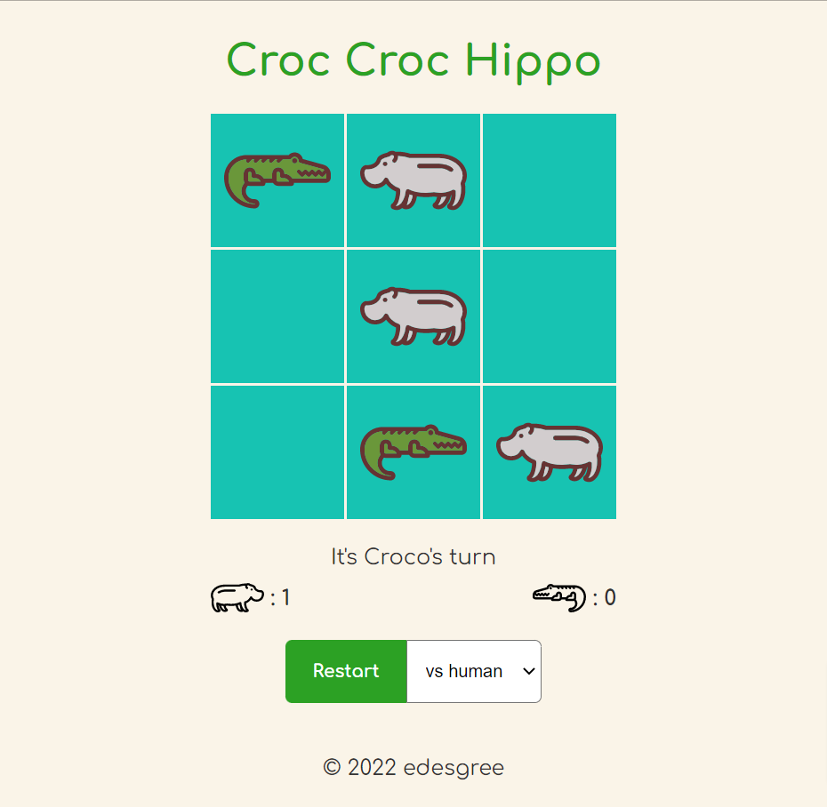

# Tic Tac Toe game in JS

The project is to create a Tic Tac Toe game using HTML, CSS and Vanilla JS.

🔗 **Live preview:** [here](https://edesgree.github.io/odin-tictactoe/public/)

### Screenshot

## Built with

### Technologies

- HTML
- CSS
- JS

### Tools

- Visual Studio Code
- Figma

## Features

- play against another human player
- play against bot (bot is choosing randomly)
- Todo: make a AI stronger using minimax method

## What I learned

- How to create IIFE modules
- How to use Array methods to get the back correct data
- How to create object using factory functions

## Author

👤 **Edouard Desgrée**

- GitHub: [edesgree](https://github.com/edesgree)

#### Created while working on the [The Odin Project](https://www.theodinproject.com/)
